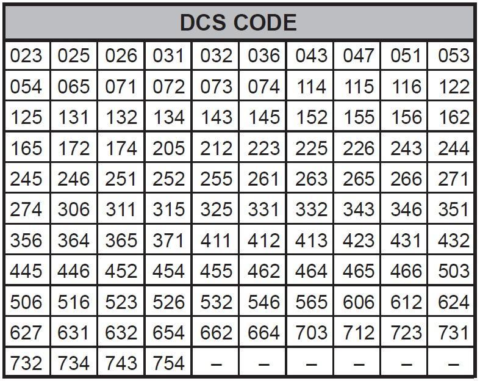
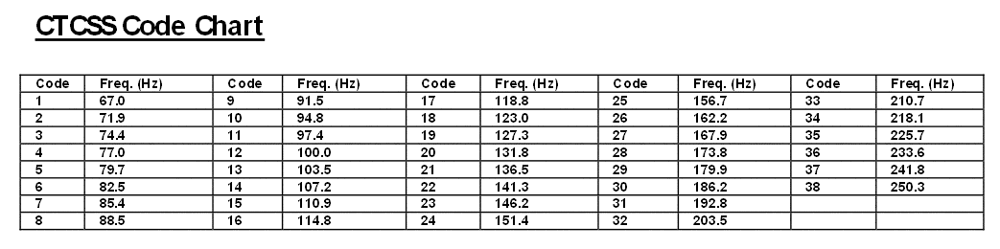

# Midland G9 Pro

 

* [User manual](0e696682f9c9f13678aeb36db453cce81be4fc38_MANUAL_G9_PRO_UK.pdf)
* Costs around €80 - €100.

## Disadvantages
* LCD-screen viewing angle is limited.
 
## Radio settings
### TX-output power
* L = 10mW
* H = 500mW

### Receiver sensitivity
* 0.35µV (12dB [SINAD](https://en.wikipedia.org/wiki/SINAD))

### Channel settings
* [Channel list](./doc/8f8ebdc9da1fd9110cbd3557c7c3e5df0c08e5ac_CHANNELS_G9_PRO.pdf)

The radio can work with two different PMR-channel sets:
1. G9 PRO traditional band : 8 frequencies (from 446.00625MHz to 446.09375 MHz, 12.5kHz steps)
   * channels 1 to 8 : with configurable CTCSS/DCS
   * channels 9 to 16 : with CTCSS fixed to code 16 (114.8 Hz)
   * channels 17 to 24 : with CTCSS fixed to code 31 (192.8 Hz)
2. G9 PRO (new band) : 16 frequencies (from 446.00625MHz to 446.19375 MHz, 12.5kHz steps)
   * channels 1 to 16 : with configurable CTCSS/DCS
   * channels 17 to 32 : with CTCSS set to code 16 (114.8 Hz)

### Squelch
Opening the squelch/monitor : keep pressed for about 2 seconds both ▲▼ at the same time. Follow the same procedure to deactivate the function, or
switch off and on the radio.

#### DCS codes

#### CTCSS codes

## Audio IO

* 3.5mm : 
  * Tip = Speaker + : 
  * Ring = ?
  * Sleeve = GND (Speaker -)
* 2.5mm : 
  * Tip = MIC_IN
    * Option 1 : Connect a PTT switch in series with electret-MIC (1K internal resistance)
    * Option 2 : Connect audio output of TNC between MIC_IN and GND.  Add a 2K2 resistor between MIC_IN and GND to activate PTT.
  * Ring = ?
  * Sleeve = GND (connected to 3.5mm sleeve inside the radio)

Don't fit a Kenwood K-1 connector in here.  It fits, but the pinout is different.
  
### Analog output
* Maximum audio output level is about 3Vpp.  Be careful : turning your volume knob open too far will cause your audio to clip, causing heavy distorted sound.
* Vcm when no audio is present = 2.40V
* Vcm when producing audio at max amplitude = 2.50V

### Analog input
PTT is activated by pulling MIC-IN to GND with a 2.2K resistor.

#### TX-Delay
Tested with 1kHz sine wave.
* From PTT down to squelch opening on FT-65 : <200ms, most of the times around 150ms.
* From PTT down to FT-65 receiving audio (with squelch continuously open) : <150ms, most of the times around 100ms.

#### TX-tail
Tested with 1kHz sine wave.
* From PTT up to squelch closing on FT-65 : <400ms
* From PTT up to FT-65 (with squelch continuously open) not receiving audio anymore : <350ms
