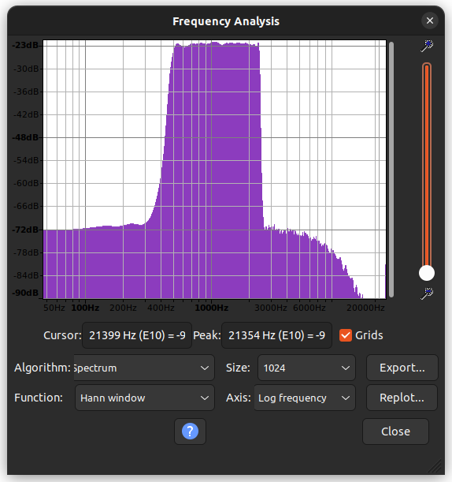
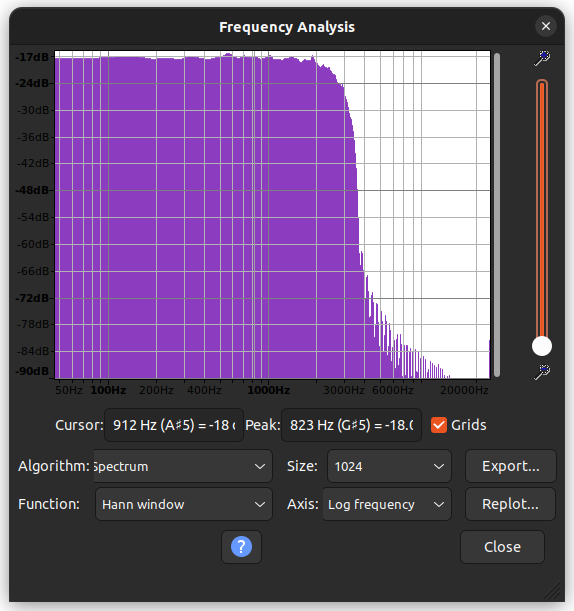
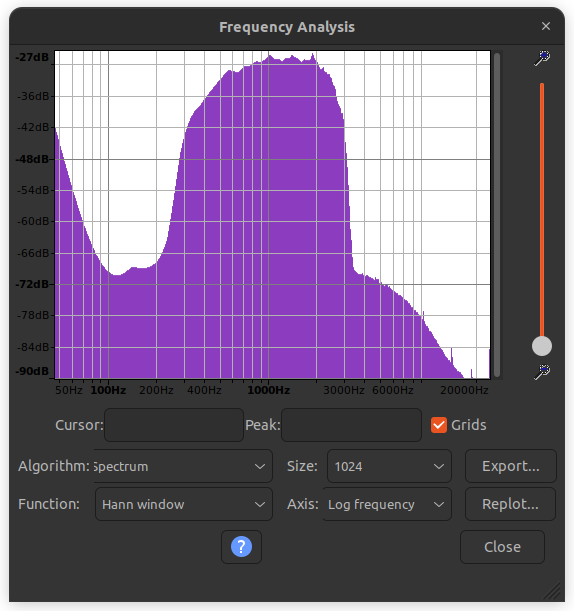
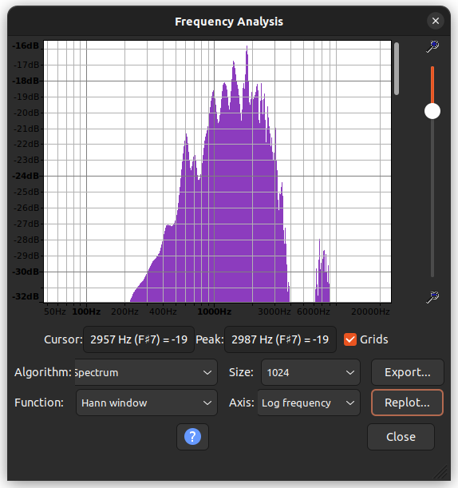

# Modem overview
| Modem | Suitable for PMR446 radios | Suitable for audio streaming | Suitable for data |
|-------|-----------------------------|------------------------------|---------------------|
| [Bell 202 1200bps](#bell-202-1200bps) | ✅ | ❌ | ✅ |
| [Bell-like 2400bps](#bell-like-2400bps) | ❌ | ❌ | ❌ |
| [V.26 : QPSK2400](#direwolf--2400bps-qpsk-itu-t-rec-v26--bell-201)| ✅| ? | ✅ |
| [V.27 : 8PSK4800](#direwolf--4800bps-8psk-itu-t-rec-v27)| ❌ | ❌ | ❌ |
| [Aicodix modem - Rattlegram - Ribbit](#aicodix-modem---rattlegram---ribbit) | ✅ | ❌ | ✅ |
| [M17](#m17) | ❌ | ✅ | ✅ |
| [FDMDV](#fdmdv---freedv-1600) | ✅ | ✅ | ❌ |
| [FreeDV 2400B](#freedv-2400b) | ✅ | ✅ | ? |
| [Fldigi](#Fldigi) | ✅ | ❌ | ✅ |

Using PMR446 radios has some [drawbacks](https://raw.githubusercontent.com/wb2osz/direwolf/master/doc/A-Better-APRS-Packet-Demodulator-Part-1-1200-baud.pdf):
* limited audio bandwidth of 300-3kHz. 
* pre/de-emphasis of audio.  This distorts the data signal.

If you want to know whether a modem is suitable for PMR446 radios without using them, you can do an offline check.  Send the encoded audio through a 300-3000Hz bandpass filter (using sox) and decode it.  If it decodes, it should work on PMR446 radios.

VARA-FM is not included in this list, because it's not open-source and it only works on Windows.

# Setup for audio loopback test through PMR446 radios
## Hardware
* Yaesu FT-65E : sending station, 50ohm dummy load, Low power setting, Narrow FM
* Midland G9Pro : receiving station
* USB-sound card :
  * Speaker output directly connected to the microphone input of the Yaesu FT-65E
  * Microphone input directly connected to the speaker output of the Midland G9Pro

## Software
### Output audio level
The output audio level of the USB-sound card is set to x %.
```bash
$ pactl set-sink-volume alsa_output.usb-GeneralPlus_USB_Audio_Device-00.analog-stereo x%
```

### Input audio level
Turn the volume knob of the Midland G90 90° clock-wise from the power-off state.  The input audio level of the USB-sound card is set to y %.  Check the volume settings with REW.  Generate a 0dBFS 1kHz audio signal and check the audio level in REW using the oscilloscope function and the spectrogram function.

```bash
The input audio level of the USB-sound card is set to y %.
```bash
$ pactl set-source-volume alsa_input.usb-GeneralPlus_USB_Audio_Device-00.mono-fallback y%
```

# Bell 202 1200bps
`minimodem` - general-purpose software audio FSK modem is used to this purpose.  It's available from the Ubuntu package manager.

The Bell 202 1200bps modulation used in APRS to send packets over the 2m FM-band.  

## Test setup
We use the same hardware test setup as in [sending from FT65-E to G9Pro](FrequencyResponse.ipynb#Connection).
The sending station is the same as the receiving station.  The sending station sends data over the headphone output of the USB sound card.  The receiving station receives data from the microphone input of the same USB sound card.

The input audio settings of the sound card don't seem to matter much.  1% and 100% both decode the message, although it's better to use a setting that doesn't overdrive your analog input.
```bash
$ pactl set-source-volume alsa_input.usb-GeneralPlus_USB_Audio_Device-00.mono-fallback 1%
$ pactl set-source-volume alsa_input.usb-GeneralPlus_USB_Audio_Device-00.mono-fallback 100%
```
The analog output setting of your USB-sound card can be set to 100%
```bash
$ pactl set-sink-volume alsa_output.usb-GeneralPlus_USB_Audio_Device-00.analog-stereo 100%
```

## Test ✅
Send a text file from one station to the other.  On the receiving side, the output is printed out on the command line.

Sending station:
```bash
$ while true; do echo "The quick brown fox jumps over the lazy dog." | minimodem --tx 1200; done
```

Receiving station:
```bash
$ minimodem --rx 1200
```

## Result
Experiments have shown that 1200bps is about the maximum for this way of generating audio FSK using the Midland G9-Pro and the Yaesu FT65-E.  2400baud doesn't work.

----

# Bell-like 2400bps
The mark and space frequencies need to be adjusted, otherwise they fall out of the 300-3000Hz audio bandwidth of the PMR446 radios.  The mark and space frequencies are 1200Hz and 2400Hz respectively (from [Direwolf user guide](https://packet-radio.net/wp-content/uploads/2018/10/Direwolf-User-Guide.pdf)).  That's Minimum Shift Keying in which the difference between the higher and the lower frequency equals half the bitrate.

The `minimodem`-command line tool is used to generate the audio.

```bash
echo "The quick brown fox jumps over the lazy dog." | minimodem --tx 2400 -f output.wav --mark 1200 --space 2400
```

Sending station:
```bash
while true; do echo "The quick brown fox jumps over the lazy dog." | minimodem --tx 2400 --mark 1200 --space 2400; done
```
Receiving station:
```bash
minimodem --rx 2400 --mark 1200 --space 2400
```
## Analog loopback through USB sound card
Receiving this signal works fine using analog loopback through USB-sound card.  The signal is a constant-amplitude frequency modulated signal.

## Loopback through PMR446 radios
When looping this through the PMR446 radios, the amplitude is far from constant.  The signal can not be decoded by minimodem.  Let's create a new audio file with a constant amplitude for further investigation.

```bash
$ echo "The quick brown fox jumps over the lazy dog." | minimodem --tx 2400 --mark 1200 --space 2400 -f bell2400.wav -R 48000
$ minimodem --rx 2400 --mark 1200 --space 2400 -f bell2400.wav -R 48000
### CARRIER 2400 @ 1200.0 Hz ###
The quick brown fox jumps over the lazy dog.
### NOCARRIER ndata=45 confidence=1.636 ampl=0.998 bps=2402.14 (0.1% fast) ###
```
bell2400.wav can be correctly decoded.  Send it through a 300-3000Hz bandpass filter:

```bash
$ sox -t wav -r 48000 bell2400.wav -t wav bell2400_filt.wav sinc 300-3000
sox WARN sinc: sinc clipped 734 samples; decrease volume?
sox WARN dither: dither clipped 635 samples; decrease volume?
$ minimodem --rx 2400 --mark 1200 --space 2400 -f bell2400_filt.wav -R 48000
### CARRIER 2400 @ 1200.0 Hz ###
խ
### NOCARRIER ndata=2 confidence=1.506 ampl=0.947 bps=2400.00 (rate perfect) ###
### CARRIER 2400 @ 1200.0 Hz ###
 � W
### NOCARRIER ndata=4 confidence=1.570 ampl=0.965 bps=2400.00 (rate perfect) ###
### CARRIER 2400 @ 1200.0 Hz ###
 W 
### NOCARRIER ndata=3 confidence=1.584 ampl=0.967 bps=2400.00 (rate perfect) ###
### CARRIER 2400 @ 1200.0 Hz ###
��
### NOCARRIER ndata=3 confidence=1.565 ampl=0.964 bps=2400.00 (rate perfect) ###
```

Decoding doesn't work with the 300-3000Hz bandpass filter.  The signal is not suitable for PMR446 radios.  Let's find out where the limits are.

```bash
$ sox -t wav -r 48000 bell2400.wav -t wav bell2400_filt.wav sinc 100-3700
sox WARN sinc: sinc clipped 147 samples; decrease volume?
sox WARN dither: dither clipped 130 samples; decrease volume?
$ minimodem --rx 2400 --mark 1200 --space 2400 -f bell2400_filt.wav -R 48000
### CARRIER 2400 @ 1200.0 Hz ###
The quick brown fox jumps over the lazy dog.

### NOCARRIER ndata=45 confidence=1.628 ampl=0.993 bps=2402.14 (0.1% fast) ###
```

At least 100-3700Hz is required for Bell-like 2400bps.  The signal is not suitable for PMR446 radios.

----

# Direwolf : 2400bps QPSK ITU-T Rec. V.26 / Bell 201
See [2400 & 4800 bps PSK for APRS / Packet Radio](https://github.com/wb2osz/direwolf/blob/master/doc/2400-4800-PSK-for-APRS-Packet-Radio.pdf) for more info about testing this mode.

```bash
$ sudo apt install direwolf
$ gen_packets -B 2400 -J -n 100 -o test2400.wav
$ sox -t wav test2400.wav -t wav test2400_filt.wav sinc 300-3300
$ atest -B 2400 -J -P P test2400.wav | grep decoded
62 packets decoded in 0.262 seconds.  154.5 x realtime
$ atest -B 2400 -J -P P test2400_filt.wav | grep decoded
70 packets decoded in 0.256 seconds.  157.6 x realtime
```

## Loopback through PMR446 radios
Use REW and the built-in 1kHz tone together with the built-in spectrum analyzer to set the audio levels correctly.

### TX station
```bash
$ aplay test2400.wav 
Playing WAVE 'test2400.wav' : Signed 16 bit Little Endian, Rate 44100 Hz, Mono
```

### RX station
```bash
$ arecord -c 1 -f S16_LE -r 44100 -d 50 recorded.wav
Recording WAVE 'recorded.wav' : Signed 16 bit Little Endian, Rate 44100 Hz, Mono
$ atest -B 2400 -J -P P recorded.wav | grep decoded
64 packets decoded in 0.340 seconds.  147.2 x realtime
```

This mode works on VHF/UHF mobile transceivers.

----

# Direwolf : 4800bps 8PSK ITU-T Rec. V.27
See [2400 & 4800 bps PSK for APRS / Packet Radio](https://github.com/wb2osz/direwolf/blob/master/doc/2400-4800-PSK-for-APRS-Packet-Radio.pdf) for more info about testing this mode.

```bash
$ gen_packets -B 4800 -n 100 -o test4800.wav
$ sox -t wav test4800.wav -t wav test4800_filt.wav sinc 300-3300
$ atest -B 4800 -P W test4800.wav | grep decoded
65 packets decoded in 0.166 seconds.  125.8 x realtime
$ atest -B 4800 -P W test4800_filt.wav | grep decoded
58 packets decoded in 0.161 seconds.  129.5 x realtime
```

Running it once again with FX.25 frames:
```bash
$ gen_packets -B 4800 -n 100 -X 64 -o test4800fx.wav
Data rate set to 4800 bits / second.
Using V.27 8PSK rather than AFSK.
Output file set to test4800fx.wav
built in message...
$ sox -t wav test4800fx.wav -t wav test4800fx_filt.wav sinc 300-3300
$ atest -B 4800 -P W test4800fx_filt.wav | grep decoded
70 packets decoded in 0.309 seconds.  132.7 x realtime
$ atest -B 4800 -P W test4800fx.wav | grep decoded
68 packets decoded in 0.316 seconds.  129.6 x realtime
```
With FEC enabled, we can decode more packets.

## Loopback through PMR446 radios
Use REW and the built-in 1kHz tone together with the built-in spectrum analyzer to set the audio levels correctly.

### TX station
```bash
$ aplay test4800.wav 
Playing WAVE 'test4800.wav' : Signed 16 bit Little Endian, Rate 44100 Hz, Mono
```

### RX station
```bash
$ arecord -c 1 -f S16_LE -r 44100 -d 30 recorded.wav
Recording WAVE 'recorded.wav' : Signed 16 bit Little Endian, Rate 44100 Hz, Mono
$ atest -B 4800 -P W recorded.wav | grep decoded
0 packets decoded in 0.247 seconds.  121.3 x realtime
```

This mode doesn't work on VHF/UHF mobile transceivers (tested with USB-soundcard and built-in soundcard of laptop)

----

# Aicodix modem - Rattlegram - Ribbit
This is the modem used in [Rattlegram](https://play.google.com/store/apps/details?id=com.aicodix.rattlegram&gl=US&pli=1).  To build it, have a look at the [installation instructions](#Installation-instructions) below, but checkout the `master`-branch instead of the `short`-branch.

Andreas Spiess made [a video about Rattlegram](https://www.youtube.com/watch?v=ubPP48ojJ3E).

* OFDM
* Selectable packet size
* Not suitable for audio streaming which requires low latency
* works with unmodified PMR446 radios (which have limited audio bandwidth)

This modem normally operates on files.  To make it decode continuously you can run:
```bash
while arecord -f S16_LE -c 1 -r 8000 - | ./decode - - ; do echo ; sleep 1 ; done
```
The encoder requires command line options for setting mode, offset and call sign.  This information is encoded in the packet, so that the decoder doesn't require any options.

As demonstrated in [rattlegram-openmodem](https://github.com/LieBtrau/rattlegram-openmodem), the ESP32 is too slow to decode the audio in real-time.  The Teensy4.0 might be fast enough.

## Master branch

### Offline test ✅
#### Step by step
```bash
$ dd if=/dev/urandom of=uncoded.dat bs=1 count=5380
5380+0 records in
5380+0 records out
5380 bytes (5.4 kB, 5.3 KiB) copied, 0.027005 s, 199 kB/s
$ ./modem-master/encode encoded.wav 8000 16 1 uncoded.dat
real PAPR: 7.04375 .. 11.5406 dB
$ ./modem-master/decode decoded.dat encoded.wav 
symbol pos: 2298
coarse cfo: 2000 Hz 
oper mode: 6
call sign: ANONYMOUS
demod .................................................. done
coarse sfo: -0.0211067 ppm
finer cfo: 2000 Hz 
init Es/N0: 30.7753 dB
$ diff -s uncoded.dat decoded.dat 
Files uncoded.dat and decoded.dat are identical
```
Encoding 5380bytes results in 11s of audio.

```python
bytecount = 5380
audio_duration = 11
bitrate = bytecount * 8 / audio_duration
print('bitrate = {:n}bps'.format(bitrate))
```

#### Quick evaluation of compatibility with VHF/UHF mobile transceivers
```bash
$ mode=7;offset=1600
$ ./encode - 8000 16 1 $offset $mode CALLSIGN uncoded.dat |sox -t s16 -r 8000 -c 1  - -t wav - sinc 300-3000 |./decode decoded.dat -
sox WARN wav: Length in output .wav header will be wrong since can't seek to fix it
symbol pos: 2301
coarse cfo: 1600 Hz 
real PAPR: 7.8043 .. 11.2667 dB
oper mode: 7
call sign:  CALLSIGN
demod ...................................................... done
coarse sfo: -0.00183248 ppm
finer cfo: 1600 Hz 
Es/N0 (dB): 36.3825 35.4475 34.7706 34.5991 33.4453 31.9402 31.7065 31.8481 31.7597 31.5086 31.4375 31.6749 31.7313 31.8028 31.915 31.8449 31.7818 31.4359 31.1164 31.0495 31.0764 31.058 30.9827 31.0011 31.0364 31.0322 31.0601 31.178 31.2443 31.0953 30.9785 31.009 31.0464 30.969 30.9021 30.8816 30.8526 30.9153 30.9527 30.9616 30.9548 30.9937 31.0538 31.0011 30.9443 30.9574 30.9964 31.0248 31.048 31.1053 31.1617 31.2243 31.2538 31.277
bit flips: 0
```

## Loopback test on USB sound card ✅
### Audio level settings
Loop back audio out to MIC-IN of the USB Sound card using a TRRS-cable. Alsamixer setting :
* Speaker : 100
* MIC : 7
The tests have been performed with this setting.

### Alternative audio level settings
The `alsamixer`-settings that have been used in this test are unsuitable for the HTs.  The Yaesu FT65-E input audio signal should not be larger than 60mVpp, otherwise the audio will be distorted.
* Speaker : 7 (-37.5dB gain) → 53mVpp at input of Yaesu FT65-E.
  * The alsa speaker control changes with the main audio control in linux.
* Microphone : audio settings → input → 100%
  * The microphone level in alsa doesn't seem to do anything.  It's the linux sound settings input level which sets the microphone input level.

```bash
$ encode encoded.wav 8000 16 1 uncoded.dat 1450 NOCALL 13
$ arecord -c 1 -f S16_LE -r 8000 -d 30 recorded.wav
```
Meanwhile on another terminal:
```bash
aplay encoded.wav
```
And when `arecord` has finished:
```bash
$ ./modem-master/decode decoded.dat recorded.wav 
symbol pos: 13821
coarse cfo: 1450 Hz 
oper mode: 13
call sign:    NOCALL
demod .............................................................................................................................. done
coarse sfo: 0.0544232 ppm
finer cfo: 1450 Hz 
init Es/N0: 31.7376 dB
```
Remark that the Es/N0, aka. signal-to-noise ratio is around 30dB.  

### Overview of modes
The _Bandwidth_ is dictated by the _Mode_.  The _Offset_ shifts the _Spectrum usage_ in the frequency domain.
_Modulation_ is derived from the _mod_bits_ variable of the [encoder](https://github.com/aicodix/modem/blob/master/encode.cc).

Mode 10 uses 3200Hz of bandwidth.  This is not compatible to walkie-talkies.

| Modulation | Mode | Offset [Hz] | Bandwidth [Hz] | Sample duration [s] | Bytes | Bitrate [bps] | Works on walkie-talkie | Es/N0 [dB] |
|------------|------|-------------|----------------|---------------------|-------|---------------|------------------------|------------|
| 8PSK       | 6    | 1650        | 2700           | 10                  | 5380  | 4304          | ✅, but 163 bit flips  | 20.7       |
| 8PSK       | 7    | 1650        | 2500           | 11                  | 5380  | 3912          | ✅, 0 bit flips        | 27.0       |
| QPSK       | 8    | 1650        | 2500           | 16                  | 5380  | 2690          | ✅, 0 bit flips        | 27.4       |
| QPSK       | 9    |             | 2250           | 18                  | 5380  | 2391          |                        |            |
| 8PSK       | 11   | 1650 - 1800 | 2400           | 11                  | 5380  | 3912          | ✅, 0 bit flips        | 27.9       |
| QPSK       | 12   |             | 2400           | 18                  | 5380  | 2391          |                        |            |
| QPSK       | 12   |             | 2400           | 18                  | 5380  | 2391          |                        |            |
| QPSK       | 13   |             | 1600           | 25                  | 5380  | 1721          |                        |            |
| QPSK       | 14   | 1600        |                | 170                 |       |               |                        |            |
| QPSK       | 15   | 1600        |                | 128                 |       |               |                        |            |
| QPSK       | 16   | 1600        |                | 85                  |       |               |                        |            |
| QPSK       | 24   |             | 1600           | 3.4                 | 512   | 1077          |                        |            |
| QAM16      | 27   | 1500        | 1700           | 2                   | 512   | 2048          | ✅                     | 26dB       |
| QAM64      | 29   | 1200-2100   | 1900           | 1.5                 | 512   | 2730          | ✅                     | 27dB       |

The 'master'-branch uses a fixed payload size of 5380 bytes, which makes it perfect for sending large files, but unsuitable for audio streaming.

Mode 11 is the winner here.  It's fast and works over a range of audio offsets.  More info on [COFDMTV](https://www.aicodix.de/cofdmtv/).

## Other versions
### Short branch
The short version creates fix length audio burst of 1.2s.  It either encodes 85 bytes (when your input file is shorter), 128 or 170 bytes of data.  Files larger than 170 bytes will be truncated to 170 bytes.  The modes are 14, 15 and 16.  This is the modem setting used in Rattlegram.
You can verify this by running the following command on your PC:
```bash
while arecord -f S16_LE -c 1 -r 8000 - | ./decode - - ; do echo ; sleep 1 ; done
```
Your PC will decode the audio in real-time.  You can now create messages on your phone using Rattlegram and "send" (acoustic coupling) them to your PC.

### Next branch
This version allows to encode packets of 256, 512 and 1024 bytes.  The 512 bytes version should be compatible to the Reticulum 500 bytes MTU.

#### Installation instructions
```bash
$ mkdir rattlegram-modem
$ cd rattlegram-modem/
$ git clone git@github.com:aicodix/dsp.git
$ git clone git@github.com:aicodix/code.git
$ git clone git@github.com:aicodix/modem.git
$ cd modem/
$ git checkout next
```
Edit `Makefile` and select the g++ compiler instead of clang++
```
#CXX = clang++ -stdlib=libc++ -march=native
CXX = g++ -march=native
```
Run make
```bash
make
```

#### Offline test
##### Offline test without filter
```bash
$ ./encode - 48000 16 1 1450 29 NOCALL uncoded.dat | ./decode - decoded.dat
symbol pos: 5716
coarse cfo: 1450 Hz 
oper mode: 29
call sign:    NOCALL
PAPR: 4.49018 .. 6.8622 dB
demod ..... done
Es/N0 (dB): 36.2695 36.1927 37.3462 38.1263 38.6745
$ diff ./uncoded.dat ./decoded.dat
```



#### Offline test with 300-3000Hz bandpass filter
```bash
$ ./encode 1.wav 48000 16 1 1450 29 NOCALL uncoded.dat
$ sox -t wav -r 48000 1.wav -t wav - sinc 300-3000  | ./decode - decoded.dat
symbol pos: 5715
coarse cfo: 1450 Hz 
oper mode: 29
call sign:    NOCALL
demod ....sox WARN sinc: sinc clipped 160 samples; decrease volume?
sox WARN dither: dither clipped 146 samples; decrease volume?
. done
Es/N0 (dB): 34.0841 34.0125 35.3639 36.2742 36.9051
$ diff ./uncoded.dat ./decoded.dat
```

Decoded audio is identical to the uncoded audio.  This should be ok for PMR446 radios.  And indeed, it is.  The audio is decoded correctly.

#### Loopback test on USB sound card
```bash
$ pactl set-sink-volume alsa_output.usb-GeneralPlus_USB_Audio_Device-00.analog-stereo 100%
$ pactl set-source-volume alsa_input.usb-GeneralPlus_USB_Audio_Device-00.mono-fallback 25%
$ arecord -c 1 -f S16_LE -r 8000 -d 5 recorded.wav
Recording WAVE 'recorded.wav' : Signed 16 bit Little Endian, Rate 8000 Hz, Mono
```
Play the encoded wave form:
```bash
$ aplay encoded.wav
```
```bash
$ ./decode decoded.dat recorded.wav
symbol pos: 2325
coarse cfo: 2000 Hz 
oper mode: 14
call sign: ANONYMOUS
demod .... done
coarse sfo: 0.217773 ppm
finer cfo: 2000 Hz 
Es/N0 (dB): 30.631 30.4578 30.2292 28.8358
bit flips: 0
```
The USB loopback caused a 1dB to 3dB reduction in SNR.

### Test using radios and USB sound card 

### Test setup

#### Hardware
This test uses the test setup as found at the end of the [audio level test](./AudioLevelTest.ipynb).

#### Command line
1. Setting the sound card's output audio volume: 
```bash
$ pactl set-sink-volume alsa_output.usb-GeneralPlus_USB_Audio_Device-00.analog-stereo 100%
```
2. Setting the sound card's input audio volume for optimal SNR: 
```bash
$ pactl set-source-volume alsa_input.usb-GeneralPlus_USB_Audio_Device-00.mono-fallback 25%
```
3. Start recording 10s audio sample:
```bash
$ arecord -c 1 -f S16_LE -r 8000 -d 10 recorded.wav
```
4. Push PTT
5. Start playing encoded audio sample:
```bash
$ aplay encoded.wav
```
6. Release PTT after audio sample has played.  Wait for the recording to finish.
7. Decode the recorded audio sample:
```bash
$ ./decode decoded.dat recorded.wav 
symbol pos: 2329
coarse cfo: 2000 Hz 
oper mode: 16
call sign: ANONYMOUS
demod .... done
coarse sfo: -36.853 ppm
finer cfo: 2000.07 Hz 
Es/N0 (dB): 26.1561 25.6838 23.3144 22.5766
bit flips: 0
```
When compared to decoding the original encoded audio, we notice that we lost around 7dB SNR.

----

## M17
* 4GFSK, 9600 baud
* Designed for audio streaming
* doesn't work on PMR446 radios because of the limited audio bandwidth
* works on some HTs with a flat audio response

### Installing M17-tools
```bash
sudo apt install pkg-config libboost-all-dev libgtest-dev libasound-dev codec2
git clone git@github.com:M17-Project/m17-tools.git
cd m17-tools
mkdir build
cd build
cmake .. -DBUILD_GUI_APPS=OFF
make
make test
```
### Testing M17
#### Digital Loopback test
```bash
cd apps
sox ../../ve9qrp.wav -t raw - |  ./m17-mod -S AB1CD -D AB2CD | ./m17-demod -l -d | play -q -b 16 -r 8000 -c1 -t s16 -
```

Reduce audio fragment length:
```bash
sox ../../ve9qrp.wav ../../ve9qrp_10s.wav trim 0 10
```

This can be split into several steps:

1. Create M17 audio file using:
```bash 
sox ../../ve9qrp_10s.wav -t raw - |  ./m17-mod -S AB1CD -D AB2CD -r > ../../ve9qrp_10s_M17.raw
```
This produces a 48kHz 16-bit mono audio file.  

2. Play this file using:
```bash
play -q -b 16 -r 48000 -c1 -t s16 ../../ve9qrp_10s_M17.raw
```

3. For user-friendly playback and analysis with Audacity, convert the raw file to WAV using:
```bash
sox -t raw -r 48000 -b 16 -c 1 -e signed-integer ../../ve9qrp_10s_M17.raw ../../ve9qrp_10s_M17.wav
```
In Audacity, the spectrogram view shows that all the energy is in the frequency range 0-3.6kHz.

4. This M17 data can be decoded and played back using:
```bash
./m17-demod -l -d < ../../ve9qrp_10s_M17.raw | play -q -b 16 -r 8000 -c1 -t s16 -
```

5. The M17 data can be decoded and saved as raw analog audio using:
```bash
./m17-demod -l -d < ../../ve9qrp_10s_M17.raw > ../../ve9qrp_10s_M17_demod.raw
```

#### Loopback through analog audio path
##### Hardware setup
Use a USB sound card.  Use a TRS-cable and connect the speaker output directly to the MIC-input.

##### Setting up REW : Input level
The audio levels of the USB-soundcard must be set correctly.  This can be done using REW.  The following steps are required:

1. Plug in the USB sound card and use a TRS-TRS cable to make an audio loop back.
2. Open REW
2. Select preferences
3. Make sure the tab "Soundcard" is selected
4. Select the USB sound card
  * Output device : default [default]
  * Input device : default [default]
5. Click the button "Calibrate soundcard..."
6. Click "Next>" two times.
7. Set the main volume control of the PC to 100%.  You can do this in three ways:
  * in Ubuntu using the main volume control in the top right corner
  * using command line: `amixer -D pulse sset Master 100%`
  * use command line: `pactl set-sink-volume alsa_output.usb-GeneralPlus_USB_Audio_Device-00.analog-stereo 100%`
8. Adjust the microphone volume control of the USB sound card to get -12dBFS input level.  You can do this in three ways : 
  * Either use the volume control in the sound settings of Ubuntu
  * use command line: `amixer -D pulse sset Capture 43%`
  * Use command line: `pactl set-source-volume alsa_input.usb-GeneralPlus_USB_Audio_Device-00.mono-fallback 43%`

##### Setting up REW : Output level
1. Open REW
2. Select "Levels"
3. Play the M17 data using:
```bash
play -q -b 16 -r 48000 -c1 -t s16 ../../ve9qrp_10s_M17.raw
```
4. Adjust the output level of the USB sound card to get -3dBFS output level.  You can do this in three ways:
  * Either use the volume control in the sound settings of Ubuntu
  * use command line: `amixer -D pulse sset Master 65%`
  * Use command line: `pactl set-sink-volume alsa_output.usb-GeneralPlus_USB_Audio_Device-00.analog-stereo 65%`

##### Software setup
Open a command line for recording the M17-data with a USB sound card.
```bash
rec -c 1 -b 16 -t s16 -r 48000 ../../test.s16 silence 1 0.1 2% 1 3.0 2% 
```
This will start the recording once audio is detected and stop after 3 seconds of silence.

Play the M17 data using:
```bash
play -q -b 16 -r 48000 -c1 -t s16 ../../ve9qrp_10s_M17.raw
```
Finally the M17 data can be decoded and played back using:
```bash
./m17-demod -l < ../../test.s16 | aplay -c 1 -f S16_LE -r 8000 --device plughw:CARD=PCH,DEV=0
```

##### Real time loopback
Open a command line for decoding M17 data and play back the decoded audio:  
```bash
rec -c 1 -b 16 -t s16 -r 48000 - | ./m17-demod -l -d | aplay -c 1 -f S16_LE -r 8000 --device plughw:CARD=PCH,DEV=0
```
Open another command line for encoding audio and transmitting M17 data:  
```bash
sox ../../apollo11_1.wav -t wav - |  ./m17-mod -S AB1CD -D AB2CD -r | play -q -b 16 -r 48000 -c1 -t s16 -
```
There are a lot of decoding errors with this setup.  I'll try looping back through the sound card of my laptop.

#### Loopback through PMR446 radio

##### Hardware setup
See [Audio level test](./doc/PMR446-radio/AudioLevelTest.ipynb)

| Analog audio path | M17 path |
| --- | --- |
| USB sound card | PMR446 radio |
|  | 

##### Results
No audio is being decoded.  Debug info shows that data can not be recovered.

##### Conclusion
It's clear from the spectrograms that these PMR446 radios are not suitable for M17.  The audio path is not flat and the audio is band limited.  The [OpenRTX-project has a list of suitable radios](https://openrtx.org/#/M17/m17), but many of these radios need hardware modificiations in the audio path.  

----

# FDMDV - FreeDV 1600
This modem gets installed with codec2.  The tests have been done with the Ubuntu version of codec2.  

## Full digital loopback audio test
Other coding rates than 1400 for Codec2 are possible, but FreeDV uses 1400.  The following command line tools are used:
```bash
sox ../m17-tools/apollo11_1.wav -t raw - | c2enc 1400 - - | fdmdv_mod - - | fdmdv_demod - - | c2dec 1400 - - | play -q -b 16 -r 8000 -c1 -t s16 -
```

## Full digital loopback random data test
FDMDV is likely designed to work specifically with Codec2.  Is it possible to just send random data through it?
```bash
fdmdv_mod audio-codec.md - | fdmdv_demod - audio-codec_out.md 
diff audio-codec.md audio-codec_out.md 
Binary files audio-codec.md and audio-codec_out.md differ
```
The data is not the same.  The data is not random, but it's not the same as the input data either.  The data is not intelligible.

## Inspect the FDMDV audio
Save the encoded audio to a WAV-file:
```bash
sox ../m17-tools/apollo11_1.wav -t wav - | c2enc 1400 - - | fdmdv_mod - - | sox -t raw -r 8000 -b 16 -c 1 -e signed-integer - fdmdv.wav
``` 
It can now be inspected in Audacity.  The spectrogram shows that the energy is in the 1-2.0kHz range so it should work on PMR446 radios.

## Real time loopback test
Test your radio setup first with REW: generate 1kHz audio and check with spectrogram that you can receive without distortion.

The computer gives an under-run error when trying to real-time encode and play the audio.  So the transmitter (Yaesu FT-65E) will play the audio we created in the previous step. 
```bash
play fdmdv.wav
```
The receiving station (Midland G9Pro) will record the audio and decode it in real-time.  The demodulator doesn't seem to check for energy level in the incoming audio.  It starts decoding noise, which generates junk audio when no signal is present.  Using the latest master build (on 2024-04-07) had the same issue.  M17 doesn't have this issue.
```bash
rec -c 1 -b 16 -t s16 -r 8000 - | fdmdv_demod - - | c2dec 1400 - - | aplay -c 1 -f S16_LE -r 8000 --device plughw:CARD=PCH,DEV=0
```
Sending FDMDV data over the PMR446 radio works.  The audio is decoded correctly, but is by times not very intelligible.  It would be better to have the option to use a higher coding rate (2400bps?) for codec2 and that the FDMDV-modem uses a wider audio bandwidth.  The PMR446 radios have more available bandwidth than the 1kHz used by FDMDV.  That should be possible with FreeDV.

# FreeDV 2400B
This mode is designed specifically for VHF analog FM.  The Codec2-1300 is used.  Golay (23,12,7) is FEC, resulting in a 2400bps data stream.  That code uses 4096 code words of 23 bits, which can correct 3 (or 5?) errors per code word.
This 2400bps data is send through a Manchester encoder to remove the DC-component.  Data gets encoded as 0x01C0 or 0xFF3F.  That's it.

You'll need to clone the [codec2 repository](https://github.com/drowe67/codec2) and build the tools yourself.

## Full digital loopback audio test
The mode can be tested on your PC using the following command line.  The modulated audio is passed through a 300Hz-3kHz bandpass filter to simulate the audio filters in the radios.  The audio is then demodulated and played back.:
```bash
$  ./freedv_tx 2400B ../../../m17-tools/apollo11_1.wav - | sox -t .s16 -r 48000 - -t .s16 - sinc 300-3000 | ./freedv_rx 2400B - - | play -t .s16 -r 8000 -
```
Remark that the modem sample rate is 48000Hz, but the audio sample rate is 8000Hz.  The audio is upsampled to 48000Hz before passing it to the modem.

Audio files can be created with:
```bash
./freedv_tx 2400B ../../../m17-tools/apollo11_1.wav - | sox -t .s16 -c 1 -r 48000 - -t wav out.wav
```


It's clear that most energy is within the 300-3kHz audio passband.

## Full digital loopback random data test
The modem can be tested with random data.  The following command line tools are used:
```bash
$ ./freedv_data_tx 2400B - --frames 15 | ./src/freedv_data_rx 2400B -
```  

## Loop back test on USB sound card
### Create the audio file
```bash
$  ./freedv_tx 2400B ../../../m17-tools/apollo11_1.wav - | sox -t .s16 -r 48000 - -t .s16 - sinc 300-3000 | sox -t raw -r 48000 -b 16 -c 1 -e signed-integer - freeDV_2400B.wav
```
### Record the audio and demodulate it
```bash
rec -c 1 -b 16 -t s16 -r 48000 - | ./freedv_rx 2400B - - | aplay -c 1 -f S16_LE -r 8000 --device plughw:CARD=PCH,DEV=0
```
### Play the audio
```bash
play freeDV_2400B.wav
```
Monitor the audio with REW Scope view to check if the audio is not distorted.  

The audio sounds good.  This modem also decodes noise when no signal is present.  It would be better if the modem would check for energy in the incoming audio.

## Real time loopback test using radios
### Hardware setup
Yaesu FT-65E sends audio to Midland G9Pro.  Input of Yaesu is connected to the output of the sound card.  Output of the Midland is connected to the input of the sound card.  Decoding works, but it's not very intelligible, maybe due to the buffer under-runs.  The audio has a lot of artefacts.
Recording the audio output from the Midland G9Pro first and then decoding it offline works much better.

## Data transmission
It should be possible according to the [README_data](https://github.com/drowe67/codec2/blob/main/README_data.md), but the example code didn't work in my case.  There's no forward error correction (FEC) on mode 2400B for data.

# Codec2 raw FSK-modem
2FSK 1200baud, 1500Hz center frequency, 1200Hz between carriers

```bash
 ./fsk_get_test_bits - 10000 | ./fsk_mod -p10 2 48000 1200 1500 1200 - - |sox -t s16 -r 48000 - -t s16  - sinc 300-3000 | ./fsk_demod -p 10 2 48000 1200 - - | ./fsk_put_test_bits -b 0.015 -
```


# Fldigi
Fldigi contains many [modes](http://www.w1hkj.com/FldigiHelp/mode_table_page.html).  This tool is data oriented.  The baudrate of the modems is too slow for the transfer of real-time codec2 data.

I have done some tests using acoustic coupling with direct smartphone to smartphone communication (no radioes) using [Andflmsg](https://github.com/cwc/AndFlmsg) which is far more user friendly than Fldigi.  