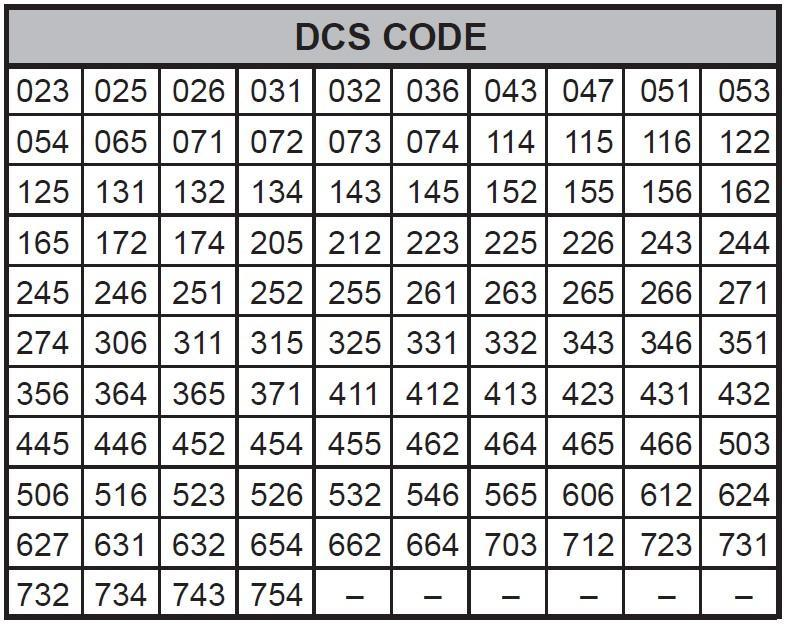
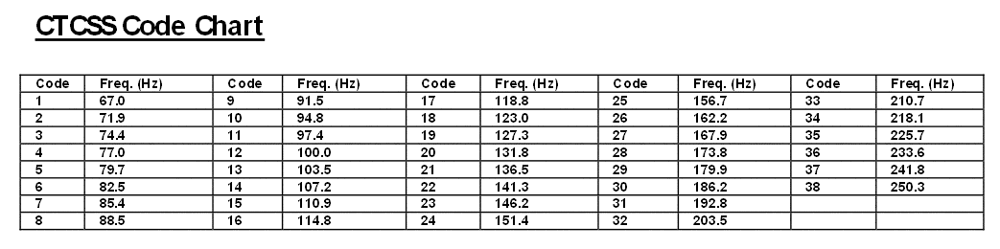

# Radio

## Midland G9 Pro

### Radio settings
The radio can work with two different PMR-channel sets
1. G9 PRO traditional band : 8 channels (+ 16 preprogrammed ones that use the same frequencies with the 8 channels)
2. G9 PRO (new band) : 16 channels (+ 16 preprogrammed ones that use the same frequencies with the 8 channels)

* [Channel list](./doc/8f8ebdc9da1fd9110cbd3557c7c3e5df0c08e5ac_CHANNELS_G9_PRO.pdf)
* [User manual](0e696682f9c9f13678aeb36db453cce81be4fc38_MANUAL_G9_PRO_UK.pdf)
* 
* 

### Audio IO
Don't fit a Kenwood K-1 connector in here.  It fits, but the pinout is different.

* 3.5mm : 
 * Tip = Speaker + : Jumps to 2V when squelch is open.  Audio max = 4V (with respect to GND)
 * Ring1 = ?
 * Ring2 = GND (Speaker -)
 * Sleeve = 
* 2.5mm : 
 * Tip = PTT switch in series with electret-MIC (1K internal resistance)
 * Ring = ?
 * Sleeve = GND

## Yaesu FT-65E

### Radio settings
European version of the FT-65 can listen to PMR446, but is not allowed to transmit on that band.  Transmission on PMR446 is only allowed with PMR446-certified radios (fixed antenna, TX-power limited to 0.5W, ...), which the FT-65E is clearly not.

It's however technically possible to use a Yaesu FT-65E on PMR446:

1. Expand TX-range of a Yaesu FT-65E outside the ham-bands using this guide [here](https://simonthewizard.com/2017/12/17/yaesu-ft-65-expand/).
2. Set the following menu options in the FT-65E:
    32 : TX Power : LOW (which is 0.5W)
    37 : WIDE/NAR : NARROW (+/-2.5kHz deviation), when set to wide the Midland cuts off reception above 800Hz.
3. Set the TX-frequency equal to that of a PMR446-radio.
4. Frequency step : 30 : Step : 6.25kHz
5. Squelch type:
  1. CTCSS:
    8 : CTCSS : set up the same as a PMR446-radio.  On Kenwood PMR446 handsets, this will be called "Quiet Talk (QT)" setting, but it's essentially the same thing.
    29 : SQL Type : TSQL
  2. DCS:
    11 : DCS-code : e.g. RX : 754, TX : 754
    29 : SQL Type : DCS
    
### Audio IO
Motorola M1 connector
* 3.5mm : 
 * Tip = speaker- (Vcm = 2.5V)
 * Ring = ?
 * Sleeve = speaker+ (Vcm = 2.5V)
* 2.5mm : 
 * Tip = PTT switch in series with electret-MIC (1K internal resistance) connected to GND :
  * Max Vin = 30mVp (=60mVpp)
 * Ring = RX/TX line
 * Sleeve = GND

## Kenwood TK-3201T
* analog FM: about 500m range in residential area
* Sensitivity - EIA 12 dB SINAD 0.28 µV (-118dBm)
* NiMH batteries don't last very long.
* [User manual](https://cdn.hackaday.io/files/1742317454299104/TK-3201(ET)-English.pdf)

### Audio IO
Kenwood K1 connector (also used on Baofeng)

# Radio comms
DCS : Digital Code Squelch (DCS) is encoded below 300Hz.  Also receivers should have a 300Hz high pass audio filter to reduce the CDCSS signal at the speaker.

## Yeasu FT-65E to Midland G9 Pro
* PMR446 (DCS enabled): max. output at 670Hz.  Bandwidth = 460Hz to 1.3kHz
* PMR446 (DCS disabled, FT65-E narrow TX, G9Pro traditional 8 channels): Bandwidth = 432Hz to 1.2kHz
* LPD433 : 
 * (DCS enabled) FT65-E set to TX:Wide : max output at 714Hz.  Bandwidth = 458Hz to 1.46kHz
 * (DCS enabled) FT65-E set to TX:Narrow : max output 612Hz at Bandwidth = 432Hz to 1.20kHz
 * (DCS disabled) FT65-E set to TX:Narrow : max output 612Hz at Bandwidth = 432Hz to 1.20kHz
 
# Radio communication modes
There are few options available for radios having only 1kHz bandwidth.  The problem is that there's no access to the modulator.  There's no way to skip the 460Hz to 1.2kHz filter.
I see no way to make digital voice work.  Digital keyboard-to-keyboard communication could work, but it would be very spectrum inefficient.

## RTTY
* Several frequency shifts possible : https://www.sigidwiki.com/wiki/Radio_Teletype_(RTTY)

## QPSK31

## MT63-2000L
* Fldigi (also on linux) , with GUI
* https://github.com/DavidGriffith/hf -> CLI
* Flmsg (on linux)
* DM780, MultiPSK

