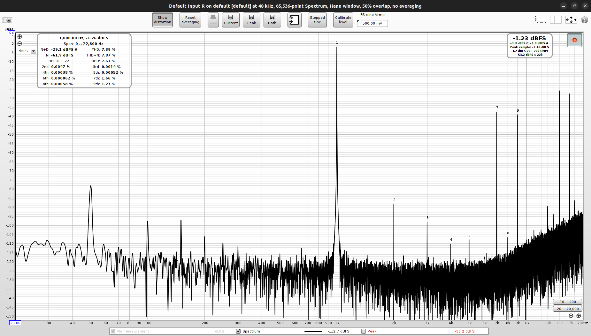

# Test
A 1kHz sine wave is generated by the ESP32 using DDS.  The sampling frequency of the ESP32 is set to 8kHz.
The codec receives the I2S signal and outputs it to the headphone jack.  The output is measured using a laptop running REW.

The output frequency is one eight of the sampling frequency.  So there are only 8 samples per period.  This is not enough to accurately represent a sine wave.  How well does the codec the reproduce the sine wave?  Is a reconstruction filter needed?

# ES8388
## Measurements

## Analysis
The output definitely needs a reconstruction filter to filter out the high frequency noise (>4kHz).  The noise is likely due to the low number of samples per period.  The codec is not able to accurately reproduce the sine wave.