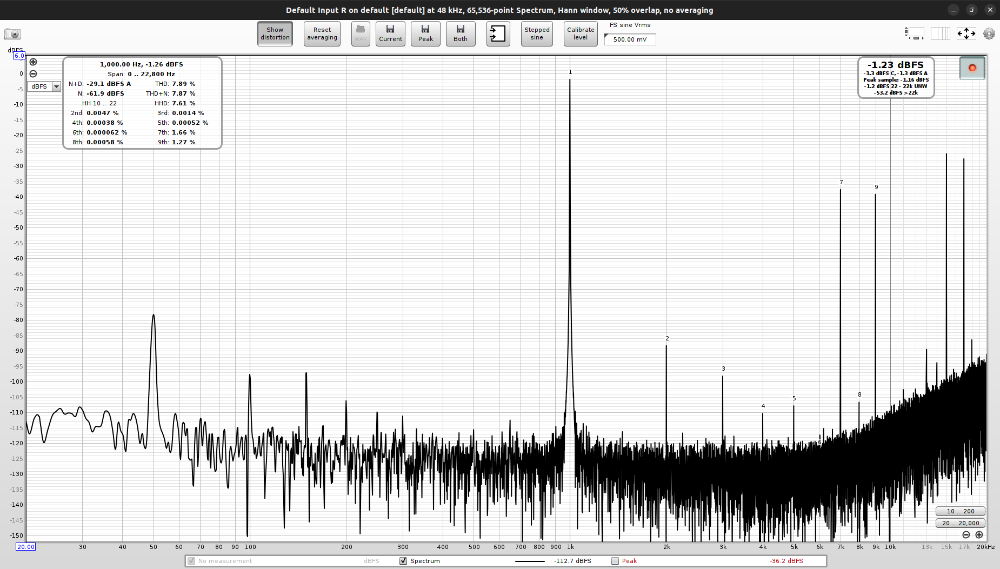
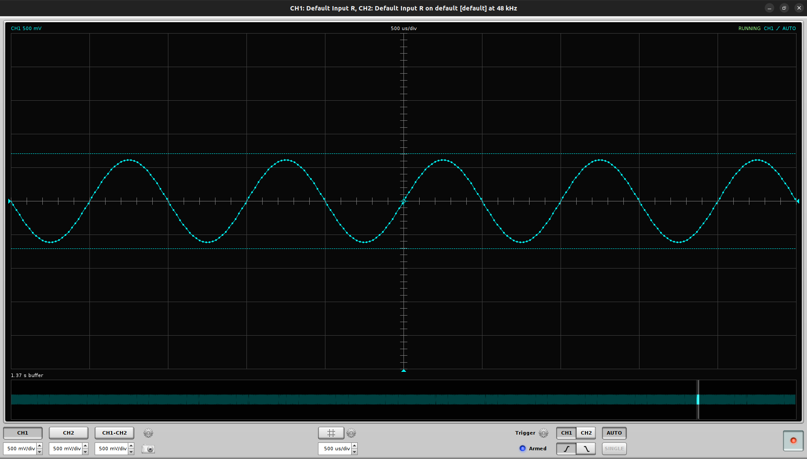
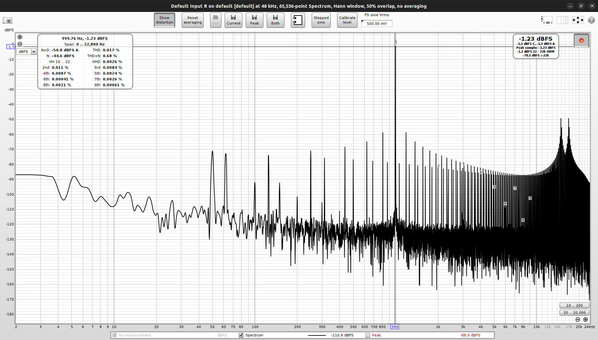
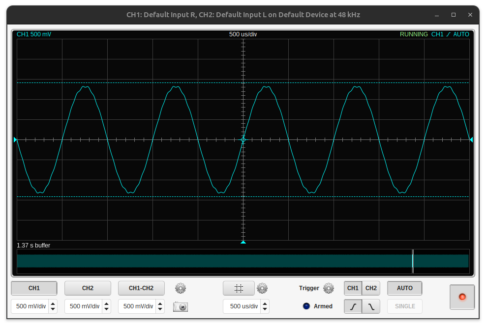
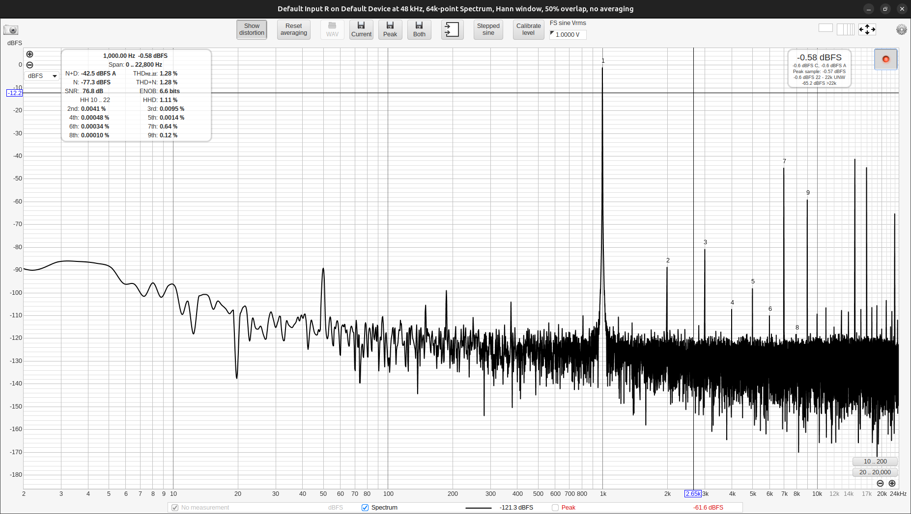
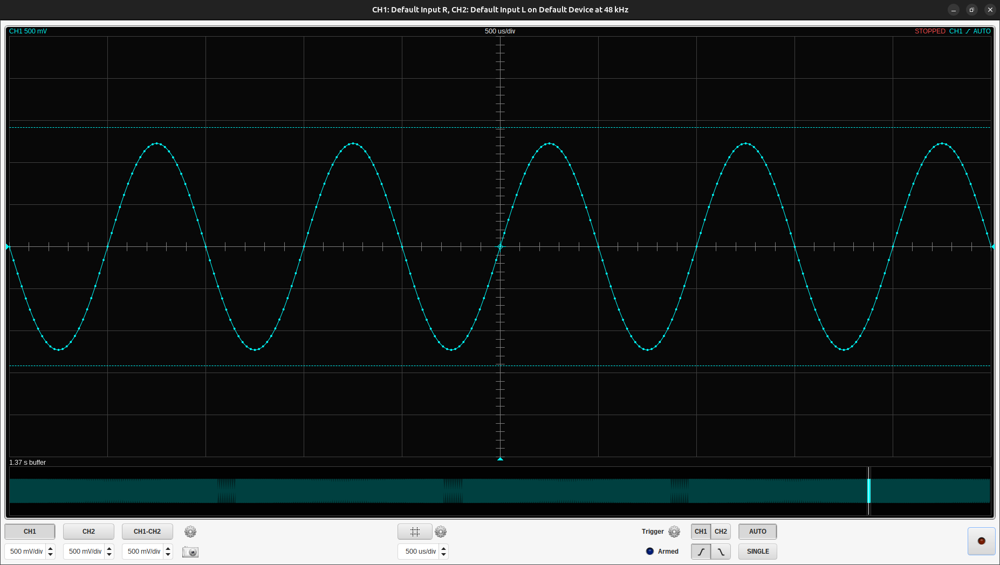
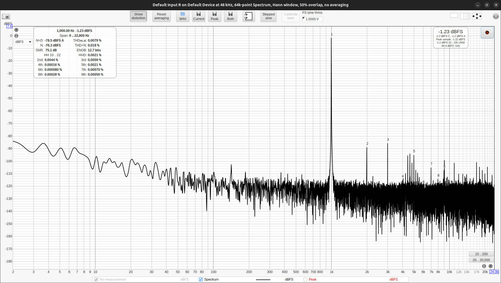

# Test
A 1kHz sine wave is generated by the ESP32 using DDS.  The sampling frequency of the ESP32 is set to 8kHz.  Such a low sampling frequency is used because plans are to run the aicodix codec at 8kHz.
The codec receives the I2S signal and outputs it to the headphone jack.  The output is measured using a laptop running REW.

The output frequency is one eight of the sampling frequency.  So there are only 8 samples per period.  This is not enough to accurately represent a sine wave.  How well does the codec the reproduce the sine wave?  Is a reconstruction filter needed?

A lot of noise is caused by noise on the USB-port.  For the noise measurements, the USB-port is disconnected.  A lab power supply is used to power the ESP32-A1S kit on the battery port.

# ES8388
## Measurements Fs = 8kHz

THD+N = 7.87%

### Analysis
The output definitely needs a reconstruction filter to filter out the high frequency noise (>4kHz).  The noise is likely due to the low number of samples per period.  The codec is not able to accurately reproduce the sine wave.

With an 8kHz sampling frequency, a high order filter is needed to filter out the image frequencies.  The filter should have a cutoff frequency of 4kHz.  The filter should have a steep roll-off to filter out the image frequencies.

To ease the design of the filter, the sampling frequency should be increased to 48kHz.  This will allow for a simpler filter design.  Creating aicodix packets at 48kHz should not be a problem for the ESP32.  For decoding, downsampling to 8kHz should be possible

## Measurements Fs = 48kHz

THD+N = 0.68%

### Analysis
The unwanted components at 8kHz are now downto -90dB.  Most of all the noise is gone.  The codec is now able to accurately reproduce the sine wave.  The codec is now ready for use in the aicodix codec.

## Measurements Fs = 8kHz, upsampling to 48kHz, 149 taps FIR filter
FIR filter designed with [Tfilter](http://t-filter.engineerjs.com/).  The filter only works with single precision floating point numbers.  With double precision floating point numbers, the filter does not work.  The ESP32 probably doesn't update in time.

THD+N = 1.28%

### Analysis
The output looks much cleaner and THD+N is much lower too.  The RTA shows much higher noise than I expected.

## Measurements Fs = 8kHz, upsampling to 48kHz, 12th order Chebyshev Type I filter
Filter designed with [Jagged Planet IIR-Explorer](http://jaggedplanet.com/iir/iir-explorer.asp).  The filter is implemented with double precision floating point numbers.

THD+N = 0.0079%